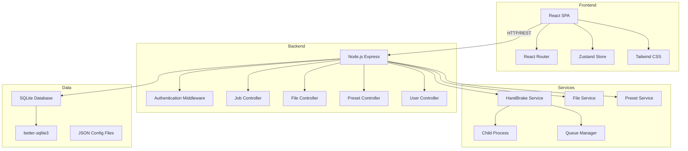
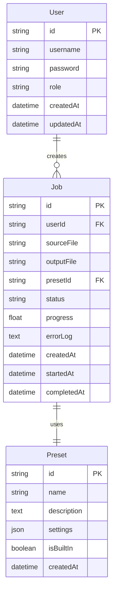

# HandBrake Web UI 技术架构文档

## 1. 系统架构

### 1.1 整体架构图


### 1.2 技术栈

| 层级 | 技术选型 | 版本 |
|------|---------|------|
| 前端框架 | React | 18.x |
| 前端语言 | TypeScript | 5.x |
| 前端路由 | React Router | 6.x |
| 状态管理 | Zustand | 4.x |
| UI 组件 | Headless UI | 2.x |
| CSS 框架 | Tailwind CSS | 3.x |
| 构建工具 | Vite | 5.x |
| 后端框架 | Express | 4.x |
| 后端语言 | TypeScript | 5.x |
| 数据库 | SQLite | 3.x |
| ORM | better-sqlite3 | 9.x |
| 认证 | jsonwebtoken | 9.x |
| 密码加密 | bcryptjs | 2.x |
| 文件上传 | multer | 1.x |
| 容器化 | Docker | 24.x |
| 基础镜像 | Debian Bookworm | 12.x |

## 2. 项目结构

```
handbrake-webui/
├── docker/
│   ├── Dockerfile
│   ├── docker-compose.yml
│   └── nginx.conf
├── backend/
│   ├── src/
│   │   ├── routes/
│   │   │   ├── auth.ts
│   │   │   ├── jobs.ts
│   │   │   ├── files.ts
│   │   │   ├── presets.ts
│   │   │   ├── system.ts
│   │   │   └── users.ts
│   │   ├── middleware/
│   │   │   ├── auth.ts
│   │   │   ├── errorHandler.ts
│   │   │   └── validator.ts
│   │   ├── services/
│   │   │   ├── handbrakeService.ts
│   │   │   └── thumbnailService.ts
│   │   ├── models/
│   │   │   └── database.ts
│   │   ├── config/
│   │   │   └── index.ts
│   │   ├── constants/
│   │   │   ├── index.ts
│   │   │   └── presets.ts
│   │   ├── utils/
│   │   │   ├── logger.ts
│   │   │   └── helpers.ts
│   │   └── types/
│   │       └── index.ts
│   ├── dist/              # TypeScript 编译输出
│   ├── tsconfig.json
│   ├── package.json
│   └── server.ts
├── frontend/
│   ├── src/
│   │   ├── components/
│   │   │   ├── common/
│   │   │   ├── layout/
│   │   │   ├── files/
│   │   │   └── BatchTranscodeModal.tsx
│   │   ├── pages/
│   │   │   ├── Login.tsx
│   │   │   ├── Dashboard.tsx
│   │   │   ├── Files.tsx
│   │   │   ├── Transcode.tsx
│   │   │   ├── Jobs.tsx
│   │   │   ├── JobDetail.tsx
│   │   │   ├── Presets.tsx
│   │   │   └── Settings.tsx
│   │   ├── hooks/
│   │   │   └── index.ts
│   │   ├── stores/
│   │   │   ├── authStore.ts
│   │   │   └── toastStore.ts
│   │   ├── services/
│   │   │   └── api.ts
│   │   ├── utils/
│   │   ├── i18n/
│   │   ├── types.ts
│   │   ├── vite-env.d.ts
│   │   ├── App.tsx
│   │   ├── main.tsx
│   │   └── index.css
│   ├── dist/              # Vite 构建输出
│   ├── tsconfig.json
│   ├── package.json
│   ├── vite.config.ts
│   └── tailwind.config.js
├── package.json (workspace)
└── README.md
```

## 3. API 设计

### 3.1 认证接口

#### POST /api/auth/register
注册新用户

**请求体:**
```json
{
  "username": "string",
  "password": "string"
}
```

**响应:**
```json
{
  "success": true,
  "data": {
    "token": "jwt_token",
    "refreshToken": "refresh_token",
    "user": {
      "id": "uuid",
      "username": "string"
    }
  }
}
```

#### POST /api/auth/login
用户登录

**请求体:**
```json
{
  "username": "string",
  "password": "string"
}
```

**响应:**
```json
{
  "success": true,
  "data": {
    "token": "jwt_token",
    "refreshToken": "refresh_token",
    "user": {
      "id": "uuid",
      "username": "string",
      "role": "admin|user"
    }
  }
}
```

#### POST /api/auth/refresh
刷新 Token

**请求体:**
```json
{
  "refreshToken": "string"
}
```

### 3.2 文件接口

#### GET /api/files
获取文件列表

**查询参数:**
- `directory`: 目录路径 (默认 /source)
- `page`: 页码 (默认 1)
- `limit`: 每页数量 (默认 20)

**响应:**
```json
{
  "success": true,
  "data": {
    "files": [
      {
        "name": "video.mp4",
        "path": "/source/video.mp4",
        "size": 1024000,
        "type": "video",
        "extension": ".mp4",
        "createdAt": "2024-01-01T00:00:00Z",
        "modifiedAt": "2024-01-01T00:00:00Z"
      }
    ],
    "pagination": {
      "total": 100,
      "page": 1,
      "limit": 20
    }
  }
}
```

#### GET /api/files/info
获取文件信息

**查询参数:**
- `path`: 文件路径

**响应:**
```json
{
  "success": true,
  "data": {
    "name": "video.mp4",
    "path": "/source/video.mp4",
    "size": 1024000,
    "duration": 3600,
    "video": {
      "codec": "h264",
      "width": 1920,
      "height": 1080,
      "fps": 30
    },
    "audio": [
      {
        "codec": "aac",
        "channels": 2,
        "language": "eng"
      }
    ]
  }
}
```

#### POST /api/files/upload
上传文件

**请求:** multipart/form-data
- `file`: 文件
- `directory`: 目标目录 (默认 /source)

### 3.3 转码任务接口

#### GET /api/jobs
获取任务列表

**查询参数:**
- `status`: 状态过滤 (queued/processing/completed/failed/cancelled)
- `page`: 页码
- `limit`: 每页数量

**响应:**
```json
{
  "success": true,
  "data": {
    "jobs": [
      {
        "id": "uuid",
        "sourceFile": "/source/video.mp4",
        "outputFile": "/output/video.mp4",
        "preset": "web-1080p",
        "status": "processing",
        "progress": 45,
        "createdAt": "2024-01-01T00:00:00Z",
        "startedAt": "2024-01-01T00:01:00Z",
        "completedAt": null
      }
    ],
    "pagination": {
      "total": 10,
      "page": 1,
      "limit": 20
    }
  }
}
```

#### POST /api/jobs
创建转码任务

**请求体:**
```json
{
  "sourceFile": "/source/video.mp4",
  "outputFile": "/output/video-encoded.mp4",
  "preset": "web-1080p",
  "customSettings": {
    "crf": 23,
    "audioCodec": "aac",
    "audioBitrate": 128
  }
}
```

#### GET /api/jobs/:id
获取任务详情

#### DELETE /api/jobs/:id
删除任务

#### POST /api/jobs/:id/cancel
取消任务

#### POST /api/jobs/:id/pause
暂停任务

#### POST /api/jobs/:id/resume
恢复任务

### 3.4 预设接口

#### GET /api/presets
获取预设列表

**响应:**
```json
{
  "success": true,
  "data": {
    "presets": [
      {
        "id": "uuid",
        "name": "Web 1080p",
        "description": "适合网页播放的 1080p 视频",
        "format": "mp4",
        "video": {
          "codec": "h264",
          "crf": 23,
          "preset": "medium",
          "width": 1920,
          "height": 1080
        },
        "audio": {
          "codec": "aac",
          "bitrate": 128,
          "channels": 2
        },
        "isBuiltIn": true
      }
    ]
  }
}
```

#### POST /api/presets
创建自定义预设

#### PUT /api/presets/:id
更新预设

#### DELETE /api/presets/:id
删除自定义预设

### 3.5 系统接口

#### GET /api/system/info
获取系统信息

**响应:**
```json
{
  "success": true,
  "data": {
    "handbrakeVersion": "1.7.0",
    "dockerVersion": "24.0.0",
    "uptime": 3600,
    "diskUsage": {
      "total": 1000000000000,
      "used": 500000000000,
      "free": 500000000000
    }
  }
}
```

#### GET /api/system/directories
获取目录映射信息

## 4. 数据模型

### 4.1 ER 图


### 4.2 数据库表定义

#### users 表
```sql
CREATE TABLE users (
    id TEXT PRIMARY KEY,
    username TEXT UNIQUE NOT NULL,
    password TEXT NOT NULL,
    role TEXT DEFAULT 'user',
    created_at DATETIME DEFAULT CURRENT_TIMESTAMP,
    updated_at DATETIME DEFAULT CURRENT_TIMESTAMP
);
```

#### jobs 表
```sql
CREATE TABLE jobs (
    id TEXT PRIMARY KEY,
    user_id TEXT NOT NULL,
    source_file TEXT NOT NULL,
    output_file TEXT NOT NULL,
    preset_id TEXT,
    status TEXT DEFAULT 'queued',
    progress REAL DEFAULT 0,
    error_log TEXT,
    created_at DATETIME DEFAULT CURRENT_TIMESTAMP,
    started_at DATETIME,
    completed_at DATETIME,
    FOREIGN KEY (user_id) REFERENCES users(id)
);
```

#### presets 表
```sql
CREATE TABLE presets (
    id TEXT PRIMARY KEY,
    name TEXT NOT NULL,
    description TEXT,
    settings TEXT NOT NULL,
    is_built_in INTEGER DEFAULT 0,
    created_at DATETIME DEFAULT CURRENT_TIMESTAMP
);
```

## 5. HandBrake CLI 集成

### 5.1 转码命令构建
```typescript
function buildHandBrakeArgs(job: Job, preset: Preset): string[] {
  const args: string[] = [
    '-i', job.source_file,
    '-o', job.output_file,
    '--json'
  ];
  
  // 应用预设设置
  if (preset.settings) {
    const settings = preset.settings;
    if (settings.format) args.push('--format', `av_${settings.format}`);
    if (settings.videoCodec) args.push('--encoder', settings.videoCodec);
    if (settings.quality) args.push('--quality', String(settings.quality));
    // ...
  }
  
  return args;
}
```

### 5.2 进度解析
HandBrake CLI 通过 JSON 输出或正则表达式解析进度:
```
Encoding: task 1 of 1, 45.234567 %
```

### 5.3 错误处理
- 捕获 stderr 输出
- 解析错误代码
- 记录完整日志

## 6. Docker 配置

### 6.1 Dockerfile
详见 [docker/Dockerfile](../docker/Dockerfile)，采用两阶段构建：
- **Builder 阶段**: 编译 TypeScript 后端代码 (tsc → dist/)，安装 Node.js 依赖
- **Runtime 阶段**: 基于 Debian Bookworm，包含 HandBrake CLI、Intel VA-API 驱动，运行编译后的 JavaScript

### 6.2 docker-compose.yml
```yaml
services:
  handbrake-webui:
    image: ray5378/handbrake-webui:latest
    container_name: handbrake-webui
    ports:
      - 52389:52389
    volumes:
      - ./config:/config
      - ./drive:/drive
    restart: unless-stopped
    devices:
      - /dev/dri:/dev/dri
```

## 7. 安全策略

### 7.1 JWT 配置
- Access Token 有效期: 1 小时
- Refresh Token 有效期: 7 天
- Token 签名算法: HS256

### 7.2 密码策略
- 最小长度: 8 字符
- 密码加密: bcrypt (cost factor 12)

### 7.3 API 安全
- 所有接口需要认证 (除了 /auth/*)
- 文件上传大小限制: 10GB
- 请求速率限制: 100 请求/分钟

## 8. 性能优化

### 8.1 前端优化
- React.lazy 路由懒加载
- 图片和视频懒加载
- 虚拟列表处理大文件列表
- 状态管理优化 (Zustand)

### 8.2 后端优化
- SQLite 连接池
- 数据库查询优化 (索引)
- 流式文件处理
- 任务队列管理

### 8.3 HandBrake 优化
- 硬件加速 (如果可用)
- 合理的并发任务数
- 任务优先级管理

## 9. 代码规范

### 9.1 通用规范

#### 9.1.1 格式化要求
- **缩进**: 使用 2 个空格
- **行宽**: 最大 100 字符
- **换行**: 每条语句单独一行
- **引号**: 字符串使用单引号，SQL 语句含内部单引号时使用双引号并添加 eslint-disable 注释
- **文件扩展名**: 后端 `.ts`，前端 `.tsx`/`.ts`

#### 9.1.2 命名约定

| 类型 | 规范 | 示例 |
|------|------|------|
| 变量 | camelCase | `userName`, `filePath` |
| 常量 | UPPER_SNAKE_CASE | `MAX_CONCURRENT_JOBS` |
| 函数 | camelCase (动词开头) | `getUserById`, `handleUpload` |
| 接口/类型 | PascalCase | `HandBrakeJob`, `AuthRequest` |
| 类名 | PascalCase | `HandBrakeService` |
| 组件 | PascalCase | `UserProfile`, `JobCard` |
| 文件名 | kebab-case | `user-service.ts`, `job-card.tsx` |
| 数据库表 | snake_case (复数) | `users`, `job_tasks` |
| API 路由 | kebab-case (名词复数) | `/api/user-accounts` |

#### 9.1.3 注释规范
```javascript
// ✅ 正确: 使用简洁注释
// 计算总页数
const totalPages = Math.ceil(total / limit);

// ❌ 错误: 无用注释
// 这是一个 for 循环
for (let i = 0; i < 10; i++) {
  // 做点什么
  doSomething();
}
```

### 9.2 TypeScript/Node.js 规范

#### 9.2.1 模块导入顺序
```typescript
// 1. Node.js 内置模块
import fs from 'fs';
import path from 'path';

// 2. 第三方模块
import express from 'express';
import jwt from 'jsonwebtoken';

// 3. 本地模块 (使用相对路径)
import config from '../config';
import { authenticateToken } from '../middleware/auth';

// 4. 类型定义
import { AuthRequest, User } from '../types';

// 排序规则: 按字母顺序排列同一级别的导入
import bcrypt from 'bcryptjs';
import { body, validationResult } from 'express-validator';
```

#### 9.2.2 错误处理
```typescript
// ✅ 正确: 统一错误处理格式
async function createUser(userData: Omit<User, 'id'>): Promise<ApiResponse<User>> {
  try {
    // 业务逻辑
    const user = await db.insert('users', userData);
    return { success: true, data: user };
  } catch (error) {
    logger.error('Failed to create user:', error);
    return {
      success: false,
      error: (error as Error).message || '创建用户失败'
    };
  }
}

// ✅ 正确: 使用 _ 前缀忽略未使用的 catch 变量
try {
  fs.statSync(path);
} catch (_e) {
  // 文件不存在时忽略
}
```

#### 9.2.3 异步编程
```typescript
// ✅ 正确: 使用 async/await，带类型标注
async function getUserById(id: string): Promise<User | undefined> {
  const user = await database.prepare(
    'SELECT * FROM users WHERE id = ?'
  ).get(id) as User | undefined;
  return user;
}

// ❌ 错误: 回调地狱
function getUserById(id: string, callback: (err: Error | null, user?: User) => void) {
  database.query('SELECT * FROM users WHERE id = ?', [id], (err, user) => {
    if (err) return callback(err);
    callback(null, user);
  });
}
```

#### 9.2.4 变量声明与类型
```typescript
// ✅ 正确: 使用 const/let + TypeScript 类型标注
const MAX_RETRY = 3;
let currentCount = 0;
const user: User | null = null;

// ❌ 错误: 使用 var
var oldStyle = 'avoid this';

// ✅ 正确: 接口定义
interface JobResult {
  id: string;
  status: 'queued' | 'processing' | 'completed' | 'failed';
  progress: number;
}
```

#### 9.2.5 类型使用规范
```typescript
// ✅ 正确: 使用 TypeScript 类型系统
import { AuthRequest } from '../types';

router.get('/jobs', authenticateToken, (req: AuthRequest, res: Response) => {
  const userId = req.user!.userId;
  // ...
});

// ✅ 正确: SQL 查询结果类型断言
const jobs = db.prepare('SELECT * FROM jobs WHERE status = ?')
  .all(status) as Job[];

// ⚠️ 使用 as any 仅在必要时（如 JWT expiresIn 类型兼容）
const token = jwt.sign(payload, secret, { expiresIn: '24h' } as any);
```

### 9.3 React/前端规范

#### 9.3.1 组件结构
```jsx
// ✅ 正确: 清晰的组件结构
function UserCard({ user, onEdit, onDelete }) {
  // 1. Hooks
  const [isEditing, setIsEditing] = useState(false);
  
  // 2. 事件处理函数
  const handleEdit = () => {
    setIsEditing(true);
    onEdit(user.id);
  };
  
  // 3. 渲染
  return (
    <div className="card">
      <h3>{user.name}</h3>
      <p>{user.email}</p>
      <div className="actions">
        <button onClick={handleEdit}>编辑</button>
        <button onClick={() => onDelete(user.id)}>删除</button>
      </div>
    </div>
  );
}

// ❌ 错误: 内联函数过多
function BadComponent() {
  return items.map(item => (
    <div 
      key={item.id}
      onClick={() => handleClick(item.id)}
      onMouseEnter={() => setHovered(item.id)}
    >
      {item.name}
    </div>
  ));
}
```

#### 9.3.2 Props 规范
```tsx
// ✅ 正确: 使用 TypeScript 接口定义 Props
interface JobCardProps {
  job: Job;
  onCancel: (id: string) => void;
  onDelete: (id: string) => void;
}

function JobCard({ job, onCancel, onDelete }: JobCardProps) {
  return <div className="job-card">{/* ... */}</div>;
}

// ✅ 正确: 解构 props 带默认值
function Component({ title, description, onSubmit, disabled = false }: {
  title: string;
  description?: string;
  onSubmit: () => void;
  disabled?: boolean;
}) {
  return <div>{/* ... */}</div>;
}

// ❌ 错误: 不使用 TypeScript 类型
function Component(props) {
  // 假设 props.disabled 默认为 false
}
```

#### 9.3.3 状态管理
```typescript
// ✅ 正确: Zustand store TypeScript 结构
import { create } from 'zustand';

interface AuthState {
  user: User | null;
  token: string | null;
  isAuthenticated: boolean;
  login: (credentials: { username: string; password: string }) => Promise<{ success: boolean; error?: string }>;
  logout: () => void;
}

const useAuthStore = create<AuthState>((set) => ({
  user: null,
  token: null,
  isAuthenticated: false,
  
  login: async (credentials) => {
    try {
      const response = await api.post<ApiResponse<{ token: string; user: User }>>('/auth/login', credentials);
      set({
        user: response.data.data.user,
        token: response.data.data.token,
        isAuthenticated: true
      });
      return { success: true };
    } catch (error) {
      return { success: false, error: (error as Error).message };
    }
  },
  
  logout: () => {
    set({
      user: null,
      token: null,
      isAuthenticated: false
    });
  }
}));

// ❌ 错误: 过多 useState
function BadComponent() {
  const [name, setName] = useState('');
  const [email, setEmail] = useState('');
  const [phone, setPhone] = useState('');
  const [address, setAddress] = useState('');
  const [city, setCity] = useState('');
  // ... 更多 useState
}
```

#### 9.3.4 Hooks 规范
```javascript
// ✅ 正确: 自定义 Hook 提取逻辑
function useJobs(filter) {
  const [jobs, setJobs] = useState([]);
  const [loading, setLoading] = useState(true);
  
  useEffect(() => {
    fetchJobs(filter).then(setJobs);
  }, [filter]);
  
  return { jobs, loading };
}

// ✅ 正确: 依赖数组完整
useEffect(() => {
  fetchUser(userId);
}, [userId]);

// ❌ 错误: 缺少依赖
useEffect(() => {
  fetchUser(userId);
  // 缺少 userId 依赖
}, []);
```

#### 9.3.5 UI 提示规范
```jsx
// ✅ 正确: 使用自定义 ConfirmDialog 替代 confirm()
import ConfirmDialog from '../components/common/ConfirmDialog';

function DeleteButton({ file, onDelete }) {
  const [showConfirm, setShowConfirm] = useState(false);

  const handleConfirm = () => {
    onDelete(file.id);
    setShowConfirm(false);
  };

  return (
    <>
      <button onClick={() => setShowConfirm(true)}>删除</button>
      <ConfirmDialog
        open={showConfirm}
        title="确认删除"
        message={`确定要删除 ${file.name} 吗？`}
        onConfirm={handleConfirm}
        onCancel={() => setShowConfirm(false)}
        danger
      />
    </>
  );
}

// ✅ 正确: 使用 Toast 通知替代 alert()
// 通过 Zustand store 或 context 触发全局 Toast
function useToast() {
  const addToast = useToastStore(state => state.addToast);

  const notify = (message, type = 'info') => {
    addToast({ message, type });
  };

  return { notify };
}

// 使用示例
function UploadButton() {
  const { notify } = useToast();

  const handleUpload = async () => {
    try {
      await uploadFile();
      notify('上传成功', 'success');
    } catch (error) {
      notify(error.message, 'error');
    }
  };

  return <button onClick={handleUpload}>上传</button>;
}

// ❌ 禁止: 使用浏览器原生弹窗
// alert('上传成功');               // 禁止
// confirm('确定删除吗？');          // 禁止
// prompt('请输入名称：');          // 禁止
```

> **规则**: 禁止使用浏览器原生 `alert()`、`confirm()`、`prompt()`。用户提示必须使用自定义组件：
> - 简单通知 → **Toast** 组件（自动消失）
> - 确认/危险操作 → **ConfirmDialog** 组件（需用户明确操作）
> - 需要用户输入 → **Modal** 对话框组件

### 9.4 API 设计规范

#### 9.4.1 RESTful 规范
```javascript
// ✅ 正确: RESTful 路由设计
// 获取资源列表
router.get('/users', getUsers);

// 获取单个资源
router.get('/users/:id', getUserById);

// 创建资源
router.post('/users', createUser);

// 更新资源
router.put('/users/:id', updateUser);
router.patch('/users/:id', partialUpdateUser);

// 删除资源
router.delete('/users/:id', deleteUser);

// ❌ 错误: 动词在 URL 中
router.get('/getUsers');
router.post('/createUser');
router.post('/updateUser');
router.post('/deleteUser');
```

#### 9.4.2 响应格式
```javascript
// ✅ 正确: 统一响应格式
// 成功响应
res.status(200).json({
  success: true,
  data: {
    id: 'uuid',
    name: 'User'
  }
});

// 错误响应
res.status(400).json({
  success: false,
  error: 'Validation failed',
  details: [
    { field: 'email', message: 'Invalid email format' }
  ]
});

// 创建成功 (201)
res.status(201).json({
  success: true,
  data: { id: 'uuid' },
  message: 'Resource created successfully'
});

// ❌ 错误: 响应格式不一致
res.json({ status: 'ok', result: data });
res.json({ success: true });
res.send('Done');
```

#### 9.4.3 HTTP 状态码
| 状态码 | 含义 | 使用场景 |
|--------|------|----------|
| 200 | OK | 成功获取/更新资源 |
| 201 | Created | 成功创建资源 |
| 204 | No Content | 成功删除（无返回体） |
| 400 | Bad Request | 请求参数错误 |
| 401 | Unauthorized | 未认证 |
| 403 | Forbidden | 无权限 |
| 404 | Not Found | 资源不存在 |
| 409 | Conflict | 资源冲突 |
| 500 | Internal Server Error | 服务器错误 |

### 9.5 Git 提交规范

#### 9.5.1 Commit Message 格式
```
<type>(<scope>): <subject>

<body>

<footer>
```

**Type 类型:**
- `feat`: 新功能
- `fix`: Bug 修复
- `docs`: 文档更新
- `style`: 代码格式（不影响功能）
- `refactor`: 重构
- `perf`: 性能优化
- `test`: 测试相关
- `chore`: 构建/工具相关

**示例:**
```bash
# ✅ 正确
git commit -m "feat(jobs): add job progress tracking"
git commit -m "fix(auth): resolve token refresh issue"
git commit -m "docs(api): update API documentation"
git commit -m "refactor(file): simplify file upload logic"

// ❌ 错误
git commit -m "updated code"
git commit -m "fix bug"
git commit -m "WIP"
```

#### 9.5.2 分支命名
```bash
# ✅ 正确
feature/user-authentication
feature/video-upload
fix/token-refresh
hotfix/security-patch
release/v1.0.0

# ❌ 错误
new-feature
fix_for_bug
MyBranch
```

### 9.6 代码检查配置

#### 9.6.1 ESLint (后端 TypeScript)
```json
{
  "env": {
    "node": true,
    "es2021": true
  },
  "extends": [
    "eslint:recommended",
    "plugin:@typescript-eslint/recommended"
  ],
  "parser": "@typescript-eslint/parser",
  "parserOptions": {
    "ecmaVersion": 2021,
    "sourceType": "module"
  },
  "plugins": ["@typescript-eslint"],
  "rules": {
    "quotes": ["error", "single", { "allowTemplateLiterals": true }],
    "semi": ["error", "always"],
    "no-unused-vars": "off",
    "@typescript-eslint/no-unused-vars": ["warn", {
      "argsIgnorePattern": "^_",
      "caughtErrorsIgnorePattern": "^_"
    }],
    "prefer-const": "error",
    "no-var": "error",
    "@typescript-eslint/no-explicit-any": "warn",
    "@typescript-eslint/no-require-imports": "off",
    "curly": ["error", "all"]
  },
  "ignorePatterns": ["node_modules/", "dist/", "build/"]
}
```

#### 9.6.2 ESLint (前端 React TypeScript)
```json
{
  "env": {
    "browser": true,
    "es2021": true
  },
  "extends": [
    "eslint:recommended",
    "plugin:react/recommended",
    "plugin:react-hooks/recommended",
    "plugin:@typescript-eslint/recommended"
  ],
  "parser": "@typescript-eslint/parser",
  "parserOptions": {
    "ecmaFeatures": { "jsx": true },
    "ecmaVersion": 2021,
    "sourceType": "module"
  },
  "plugins": ["react", "react-hooks", "@typescript-eslint"],
  "rules": {
    "react/react-in-jsx-scope": "off",
    "react/prop-types": "off",
    "quotes": ["error", "single", { "allowTemplateLiterals": true }],
    "semi": ["error", "always"],
    "no-unused-vars": "off",
    "@typescript-eslint/no-unused-vars": ["warn", {
      "argsIgnorePattern": "^_",
      "caughtErrorsIgnorePattern": "^_"
    }],
    "prefer-const": "error",
    "no-var": "error",
    "react-hooks/rules-of-hooks": "error",
    "react-hooks/exhaustive-deps": "warn",
    "jsx-quotes": ["error", "prefer-single"],
    "@typescript-eslint/no-explicit-any": "warn",
    "no-restricted-globals": ["error", {
      "name": "alert",
      "message": "禁止使用 alert()，请使用自定义 Toast 组件替代"
    }, {
      "name": "confirm",
      "message": "禁止使用 confirm()，请使用 ConfirmDialog 组件替代"
    }, {
      "name": "prompt",
      "message": "禁止使用 prompt()，请使用自定义 Modal 对话框组件替代"
    }]
  },
  "settings": { "react": { "version": "detect" } },
  "ignorePatterns": ["node_modules/", "dist/", "build/"]
}
```

#### 9.6.3 Prettier 配置
```json
{
  "semi": true,
  "singleQuote": true,
  "tabWidth": 2,
  "trailingComma": "none",
  "printWidth": 100,
  "arrowParens": "avoid",
  "endOfLine": "lf"
}
```

### 9.7 代码审查清单

#### 9.7.1 PR 提交前自检
- [ ] 代码符合格式化规范
- [ ] ESLint 检查通过（0 errors）
- [ ] TypeScript 类型检查通过（tsc --noEmit）
- [ ] 所有测试通过
- [ ] 导入了必要的依赖
- [ ] 没有硬编码的敏感信息
- [ ] 没有使用 `alert()`/`confirm()`/`prompt()`
- [ ] API 响应格式一致
- [ ] 错误处理完整
- [ ] 类型标注完整（避免 any）
- [ ] 提交信息符合规范

#### 9.7.2 Code Review 重点
- **安全性**: 是否有 SQL 注入、XSS、CSRF 风险
- **性能**: 是否有 N+1 查询、不必要的重渲染
- **可维护性**: 代码是否清晰、职责是否单一
- **测试覆盖**: 关键逻辑是否有测试
- **边界情况**: 错误处理是否完整
