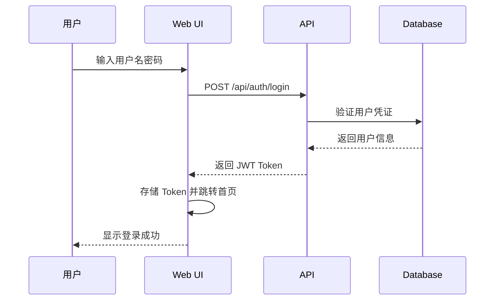
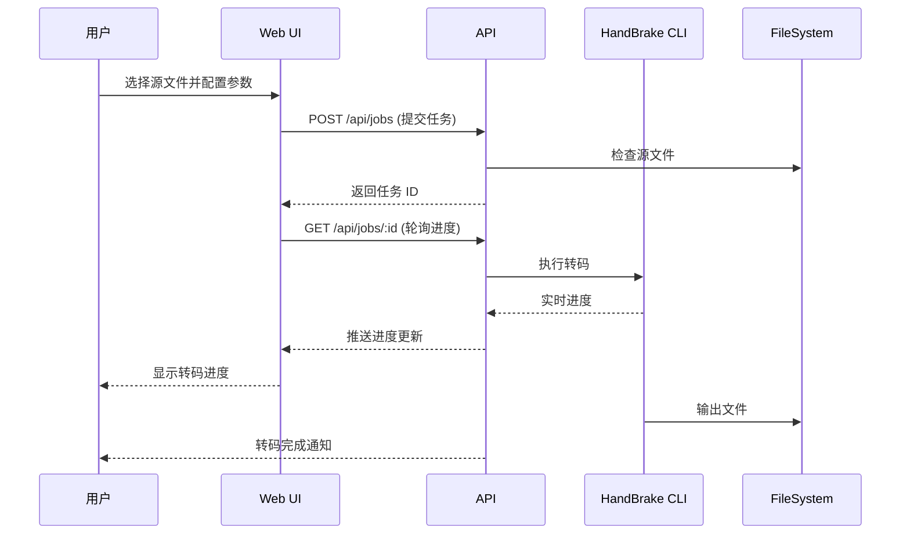
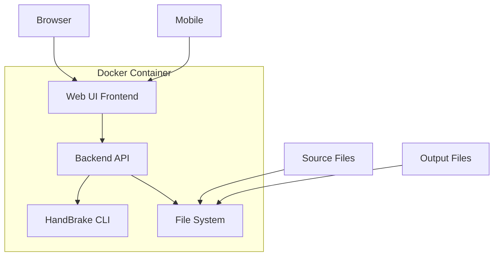

# HandBrake Web UI 产品需求文档

## 1. 产品概述

基于 HandBrake 的 Web 视频转码管理界面,提供跨平台浏览器访问的视频转码服务。支持 Docker 一键部署,具备 JWT 认证、实时转码监控、响应式设计(桌面端/移动端自适应)等功能,满足个人用户和小型团队的远程视频转码需求。

### 核心价值
- 远程访问: 通过浏览器随时随地管理视频转码任务
- 便捷部署: Docker 一键部署,无需手动配置环境
- 安全认证: JWT Token 认证保护,支持多用户管理
- 跨设备兼容: 响应式设计,桌面端和移动端体验一致

## 2. 功能模块

### 2.1 用户认证模块

| 功能 | 描述 |
|------|------|
| 用户注册 | 支持用户名/密码注册,自动生成 JWT Token |
| 用户登录 | 支持登录验证,返回 Access Token 和 Refresh Token |
| Token 刷新 | Access Token 过期后自动刷新 |
| 密码修改 | 已登录用户可修改密码 |
| 会话管理 | 支持强制登出所有设备功能 |

### 2.2 文件管理模块

| 功能 | 描述 |
|------|------|
| 源文件浏览 | 列出映射目录中的所有视频文件 |
| 文件上传 | 支持拖拽上传视频文件到转码目录 |
| 文件预览 | 显示视频文件基本信息(分辨率、时长、编码等) |
| 下载文件 | 下载转码完成的文件 |
| 文件删除 | 删除选定的文件 |

### 2.3 转码配置模块

| 功能 | 描述 |
|------|------|
| 输出格式选择 | 支持 MP4、MKV、WebM 等格式 |
| 编码器选择 | H.264、H.265、VP9、AV1 |
| 预设方案 | 内置多种转码预设(Fast、Quality、Web 等) |
| 自定义参数 | 支持 CRF、码率、分辨率等高级参数 |
| 音频配置 | 音频轨道选择、编码器、音量调整 |
| 字幕配置 | 内嵌字幕、烧录字幕、字幕轨道选择 |

### 2.4 转码队列模块

| 功能 | 描述 |
|------|------|
| 任务提交 | 提交转码任务到队列 |
| 队列管理 | 查看所有排队/转码中/已完成任务 |
| 实时进度 | 显示转码进度、预估剩余时间 |
| 任务控制 | 暂停、恢复、取消转码任务 |
| 批量操作 | 批量提交任务、批量删除已完成任务 |
| 错误日志 | 显示转码过程中的错误信息 |

### 2.5 系统设置模块

| 功能 | 描述 |
|------|------|
| 目录映射 | 查看当前映射的转码目录和配置目录 |
| 默认预设 | 设置默认转码预设 |
| 并发转码 | 配置同时进行的转码任务数量 |
| 存储管理 | 查看磁盘使用情况 |
| 系统信息 | 显示 Docker 容器状态、HandBrake 版本 |

## 3. 页面结构

| 页面名称 | 功能描述 |
|---------|----------|
| 登录页 | 用户登录/注册界面 |
| 首页/仪表盘 | 显示系统概览、转码统计、快捷操作 |
| 文件管理页 | 文件浏览、上传、下载、删除 |
| 转码配置页 | 选择源文件、配置转码参数 |
| 任务队列页 | 查看和管理所有转码任务 |
| 任务详情页 | 查看单个任务的详细信息和日志 |
| 设置页 | 系统配置和用户管理 |
| 预设管理页 | 创建、编辑、删除转码预设 |

## 4. 用户流程

### 4.1 用户登录流程

### 4.2 提交转码任务流程

## 5. 界面设计

### 5.1 设计风格
- **主题**: 现代深色主题,减少视觉疲劳
- **配色方案**:
  - 主色调: #6366F1 (靛蓝色)
  - 次要色: #22D3EE (青色)
  - 成功色: #10B981 (绿色)
  - 警告色: #F59E0B (橙色)
  - 错误色: #EF4444 (红色)
  - 背景色: #0F172A (深蓝灰)
  - 卡片背景: #1E293B (稍浅的蓝灰)
- **字体**:
  - 标题: Inter (700 weight)
  - 正文: Inter (400 weight)
  - 代码/数字: JetBrains Mono
- **圆角**: 12px (卡片), 8px (按钮), 6px (输入框)
- **阴影**: 柔和的阴影效果增加层次感

### 5.2 响应式设计
- **桌面端 (≥1024px)**:
  - 侧边导航栏固定
  - 主内容区自适应
  - 文件列表以网格/列表双视图展示
- **平板端 (768px - 1023px)**:
  - 侧边栏可折叠
  - 单列布局
- **移动端 (<768px)**:
  - 底部导航栏
  - 卡片式布局
  - 简化操作按钮
  - 触摸友好的大按钮

### 5.3 关键交互
- **拖拽上传**: 拖拽视频文件到上传区域
- **实时预览**: 视频文件预览(缩略图、时长)
- **进度环**: 转码进度以环形图展示
- **Toast 通知**: 操作成功/失败提示
- **确认对话框**: 危险操作(删除、取消)的二次确认

## 6. Docker 部署

### 6.1 容器架构

### 6.2 目录映射
- `/config`: HandBrake 配置目录
- `/source`: 源视频文件目录
- `/output`: 转码输出目录
- `/data`: 数据库和用户数据

### 6.3 环境变量
| 变量 | 描述 | 默认值 |
|------|------|--------|
| ADMIN_USERNAME | 管理员用户名 | admin |
| ADMIN_PASSWORD | 管理员密码 | (随机生成) |
| JWT_SECRET | JWT 密钥 | (随机生成) |
| PORT | Web 服务端口 | 3000 |
| MAX_CONCURRENT_JOBS | 最大并发任务数 | 2 |

## 7. 安全考虑

- 所有 API 请求需要 JWT 认证
- 敏感操作(删除、取消)需要额外确认
- 文件路径防止目录遍历攻击
- 限制上传文件类型和大小
- API 请求限流防止滥用
- CORS 配置限制跨域请求

## 8. 性能指标

- 页面加载时间: < 2s (首次加载)
- API 响应时间: < 200ms (无转码操作)
- 转码进度更新: 每秒 1 次
- 支持同时在线用户: 10+
- 支持队列任务数: 100+
